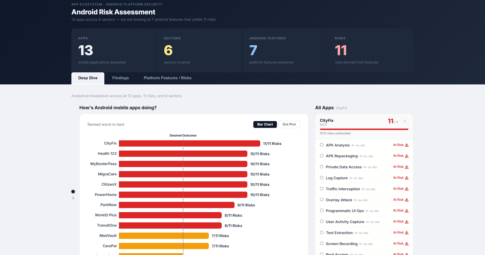

# Android Security Assessment Dashboard

A React + Node.js dashboard for tracking Android app security findings across multiple risk categories and sectors. Findings are persisted in a local SQLite database and served via a lightweight Express API.

## Prerequisites

- [Node.js](https://nodejs.org/) v18+
- A terminal that supports two concurrent sessions (e.g. Windows Terminal, VS Code integrated terminal)

## 1. Install dependencies

Clone or download the project, then from the project root:

```bash
npm install
```

## 2. Start the API server

The API server reads and writes findings to the local SQLite database (`data/dashboard.db`).

```bash
npm run api
```

You should see:
```
API listening on http://127.0.0.1:8787
```

> The default port is `8787`. To use a different port, set the `API_PORT` environment variable before running.

## 3. Start the frontend

In a **second terminal**, from the same project root:

```bash
npx vite
```

You should see:
```
VITE ready in Xms
➜  Local:   http://localhost:5173/
```

## 4. Open the dashboard

Navigate to [http://localhost:5173](http://localhost:5173) in your browser.

The dashboard loads live data from the API. Both the API server and frontend must be running simultaneously.

## Project structure

```
android-dashboard/
├── data/
│   └── dashboard.db        # SQLite database (pre-seeded)
├── server/                 # Express API server
├── src/
│   └── App.jsx             # Main React app + default dataset
├── package.json
└── vite.config.js
```
## Expected Outcome
